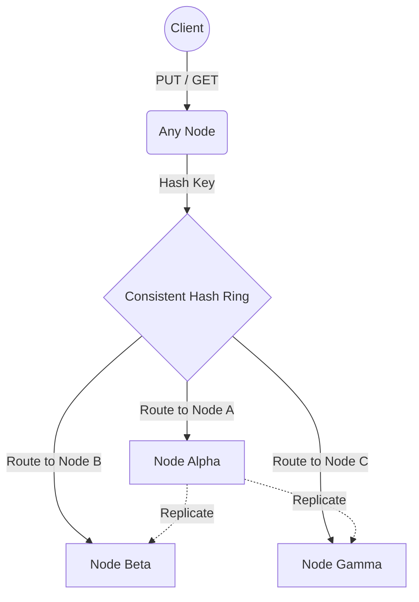
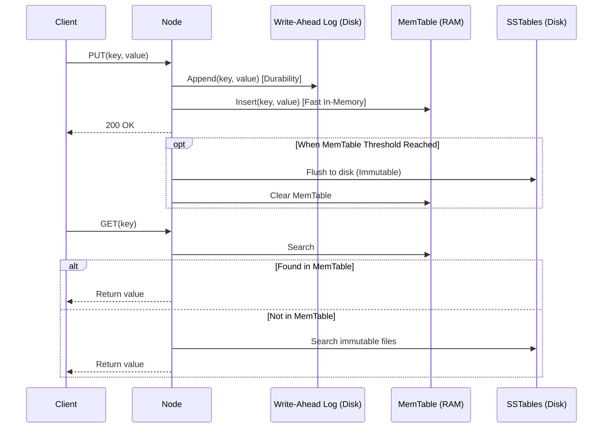

# Distributed Key-Value Store

A high-performance, distributed, and persistent Key-Value Store implemented in modern C++17. 

This project is deeply inspired by production-grade distributed systems like Amazon Dynamo, Apache Cassandra, and Riak. It implements a complete distributed system architecture from scratch, including data partitioning, replication, failure detection, conflict resolution, and an LSM-tree-based persistent storage engine.

> 📖 **Reference & Inspiration:** This project's architecture heavily borrows concepts from the classic system design problem: **[Design a Key-Value Store (ByteByteGo)](https://bytebytego.com/courses/system-design-interview/design-a-key-value-store)**.

---

## 🏗 Core Architecture & Flow

The system is built as a peer-to-peer (P2P) distributed cluster. There is no central master node; every node is identical and capable of handling client requests, routing them, and storing data.

### 1. High-Level Flow (How a request is handled)

When a client sends a `GET` or `PUT` request to any node in the cluster, the node uses **Consistent Hashing** to determine which node actually owns that data. If the receiving node is the owner, it processes the request locally. If not, it proxies the request to the correct node.



### 2. The Storage Engine (LSM Tree)

Each node uses a **Log-Structured Merge-Tree (LSM)** storage engine for fast, sequential writes and durable storage. 

- **WAL (Write-Ahead Log):** Every write is appended to a durable disk log before acknowledging the client. This ensures zero data loss on crash.
- **MemTable:** An in-memory sorted data structure (like an AVL tree or Red-Black tree) that absorbs all incoming writes and serves fast reads.
- **SSTable (Sorted String Table):** When the MemTable fills up, it is flushed to disk as an immutable SSTable. Reads that miss the MemTable search the SSTables on disk.



---

## 🧠 Distributed System Concepts Implemented

### 🔄 Consistent Hashing
Instead of standard modulo hashing (`hash(key) % N`), we map both nodes and keys to a virtual ring (0 to 2^32). This dramatically minimizes data movement when nodes join or leave the cluster. We also use **Virtual Nodes** to ensure data is evenly distributed across physical servers, even if they have different hardware capacities.

### 💓 Gossip Protocol (Failure Detection)
To detect dead nodes and discover new ones, nodes constantly "gossip" with each other in the background. Every second, a node picks random peers and exchanges its membership list and heartbeat counters. If a node's heartbeat stops incrementing for a set duration, the cluster marks it as `DEAD`.

### ⏱️ Vector Clocks (Conflict Resolution)
In a distributed environment where network partitions happen, multiple clients might update the same key concurrently on different nodes. **Vector Clocks** track the causal history of updates (e.g., `[NodeA: 2, NodeB: 1]`). During a read, if the system detects divergent versions, it can return both to the client to resolve, or use Last-Write-Wins (LWW) as a fallback.

### 🌳 Merkle Trees (Anti-Entropy / Background Sync)
To keep replicas in sync efficiently, nodes build Merkle Trees (Hash Trees) over their key-value ranges. Instead of comparing entire databases byte-by-byte, nodes compare the root hashes of their Merkle trees. If they differ, they traverse down the tree to find exactly which individual keys are out of sync and repair them.

---

## 🚀 Getting Started

### Prerequisites
- **CMake** ≥ 3.16
- **C++17** compatible compiler (GCC ≥ 7, Clang ≥ 5)

### Build & Run Locally
```bash
# Compile the native C++ backend
cmake -B build -DCMAKE_BUILD_TYPE=Release
cmake --build build --target kvstore_server -j$(nproc)

# Start the cluster and Web UI (defaults to port 8080)
./run_ui.sh
```

### Deployment (Server / Production)
We include a full automated GitHub Actions CI/CD pipeline (`.github/workflows/deploy.yml`) and an automated deployment script (`deploy.sh`) for installing the cluster on remote Linux servers using `systemd`. 

```bash
# Push to main to trigger GitHub Actions deployment
git push origin main

# Or deploy manually via script over SSH/Tailscale:
./deploy.sh ubuntu@<server-ip> 8080
```

---

## 🧪 Testing

The project has comprehensive unit tests using GoogleTest.

```bash
# Build all tests
cmake -B build -DBUILD_TESTS=ON
cmake --build build

# Run all tests via CTest
ctest --test-dir build --output-on-failure
```

---

## 📂 Project Structure

```
kv-store/
├── src/                    # C++ Backend Implementation
│   ├── consistent_hash.cpp # Routing & virtual nodes
│   ├── gossip.cpp          # Failure detection
│   ├── merkle_tree.cpp     # Anti-entropy replica sync
│   ├── storage_engine.cpp  # LSM tree orchestrator
│   ├── memtable.cpp        # RAM store
│   ├── sstable.cpp         # Disk store
│   ├── wal.cpp             # Write-ahead log
│   ├── vector_clock.cpp    # Conflict resolution
│   └── server.cpp          # HTTP REST API & multi-threading
├── include/kvstore/        # Public headers
├── web/                    # Rich Interactive Web UI Dashboard
├── tests/                  # GoogleTest unit test suites
└── deploy.sh               # Remote deployment script
```
